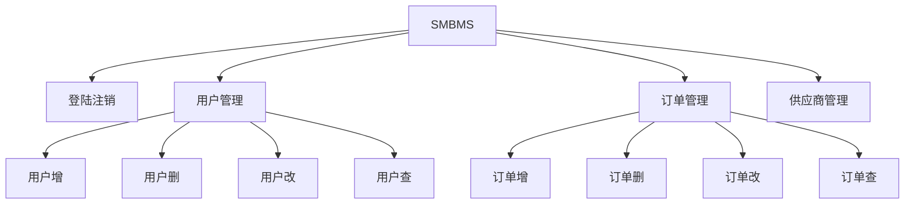
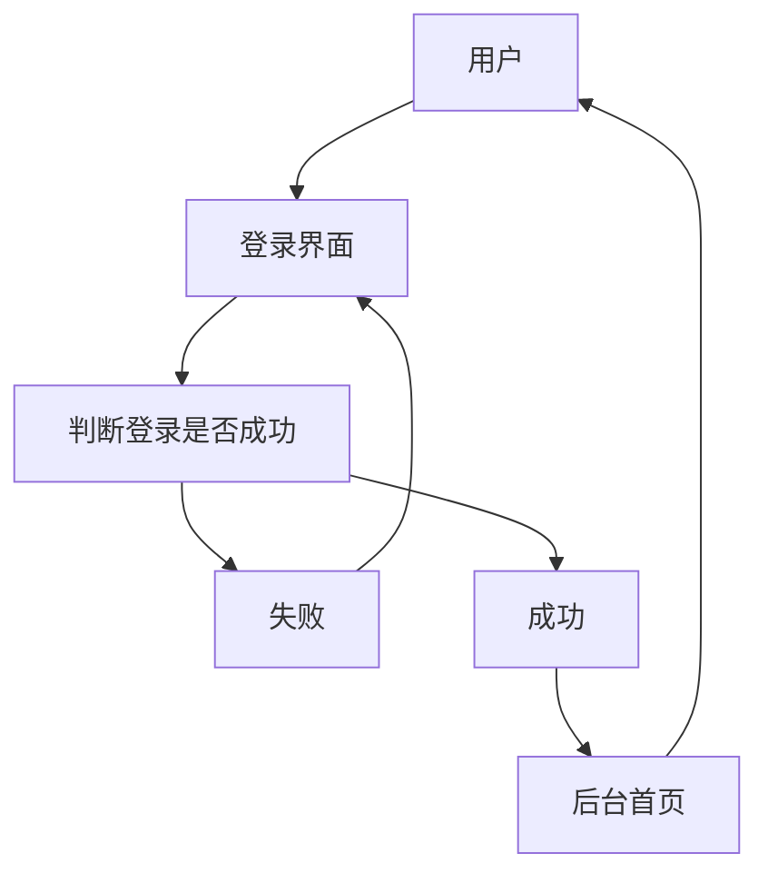
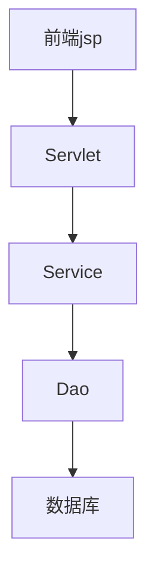
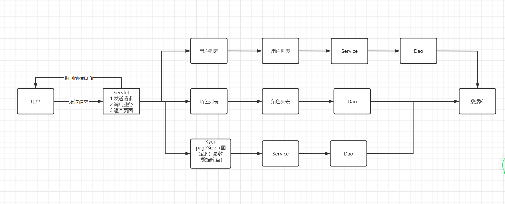
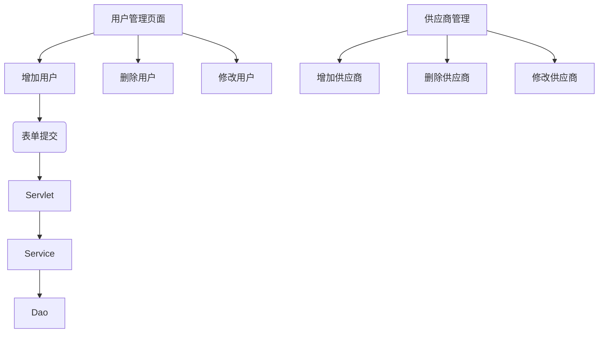

# SMBMS



数据库


## 项目搭建准备工作

1. 大家一个Maven web项目
2. 配置tomcat项目
3. 测试项目是否能够跑起来
4. 导入项目中需要的jar包
jsp,Servlet,mysql驱动，jstl,stand...
5. 创建项目包结构

6. 编写实体类
ORM映射：表-类映射
7. 编写基础公共类
    1. 数据库配置文件

        ```properties
        driver=com.mysql.Driver
        url=jdbc:mysql://localhost:3306?useUnicode=true&characterSet=utf-8
        user=root
        password=yan2000926
        ```

    2. 编写数据库的公共类
    3. 编写字符编码过滤器
8. 导入静态资源

## 登录功能的实现



1. 编写前端页面
2. 设置首页

```xml
    <welcome-file-list>
        <welcome-file>login.jsp</welcome-file>
    </welcome-file-list>
```

3. 编写dao层用户登录接口

```java
public interface UserDao {
 //得到登录的用户
 public User getLoginUser(Connection conn, String userCode) throws SQLException;
}
```

4. 编写dao接口的实现类

```java
public class UserDaoImp1 implements UserDao{
 @Override
 public User getLoginUser(Connection conn, String userCode) throws SQLException {
  ResultSet rs = null;
  User user = null;
  PreparedStatement ps= null;
  String sql = "select * from smbms_user where userCode=?";
  Object[] params = {userCode};
  rs = BaseDao.execute(conn,sql,params);
  while(rs.next()) {
   user = new User();
   user.setId(rs.getInt("id"));
   user.setUserCode(rs.getString("userCode"));
   user.setUserName(rs.getString("userName"));
   user.setUserPassword(rs.getString("userPassword"));
   user.setGender(rs.getInt("gender"));
   user.setBirthday(rs.getDate("birthday"));
   user.setPhone(rs.getString("phone"));
   user.setAddress(rs.getString("address"));
   user.setUserRole(rs.getInt("userRole"));
   user.setCreatedBy(rs.getInt("createdBy"));
   user.setCreationDate(rs.getDate("creationDate"));
   user.setModifyBy(rs.getInt("modifyBy"));
   user.setModifyDate(rs.getDate("modifyDate"));

  }
  BaseDao.closeResource(conn,ps,rs);

  return user;
 }
}

```

5. 业务层接口

```java
public interface UserDao {
 //得到登录的用户
 public User getLoginUser(Connection conn, String userCode) throws SQLException;
}

```

6. 业务层实现类

```java
public class UserServiceImp1 implements UserService{
 //业务层都会调用dao层，所以我们要引入dao层
 private UserDao userDao;

 public UserServiceImp1(){
  userDao = new UserDaoImp1();
 }
 @Override
 public User login(String userCode, String password) {
  Connection conn = null;
  User user = null;


  try {
   conn = BaseDao.getConnection();
   //通过业务层调用对应的具体的数据库操作
   user = userDao.getLoginUser(conn, userCode);
  } catch (SQLException e) {
   e.printStackTrace();
  }finally{
   BaseDao.closeResource(conn,null,null);
  }
  return user;
 }
 
}

```

7. 编写Servlet

```java
protected void doGet(HttpServletRequest req, HttpServletResponse resp) throws ServletException, IOException {
  System.out.println("LoginServlet--start...");

  //获取用户名和密码
  String userCode = req.getParameter("userCode");
  String userPassword = req.getParameter("userPassword");

  //和数据库的密码进行对比，调用业务层；
  UserServiceImp1 userServiceImp1 = new UserServiceImp1();
  User user = userServiceImp1.login(userCode, userPassword);//这里已经把登录的人给差不来了

  if(user != null) {
   //将用户信息放进session
   req.getSession().setAttribute(Constants.USER_SESSION,user);
   //跳转到到主页
   resp.sendRedirect("jsp/frame.jsp");
  }else{//查无此人，无法登陆，转发回登录界面，提示用户名或密码错误
   req.setAttribute("errpr","用户名或者密码错误");
   req.getRequestDispatcher("login.jsp").forward(req,resp);

  }


 }
```

8. 注册Servlet

```xml
<servlet>
        <servlet-name>LoginServlet</servlet-name>
        <servlet-class>com.lemon.servlet.user.LoginServlet</servlet-class>
    </servlet>

    <servlet-mapping>
        <servlet-name>LoginServlet</servlet-name>
        <url-pattern>/login.do</url-pattern>
    </servlet-mapping>
```

## 登录功能优化

注销功能：

思路：移除Session、返回登录页面

```java
public class LoginOutServlet extends HttpServlet {
 @Override
 protected void doGet(HttpServletRequest req, HttpServletResponse resp) throws ServletException, IOException {
  req.getSession().removeAttribute(Constants.USER_SESSION);
  System.out.println(req.getContextPath());
  resp.sendRedirect(req.getContextPath()+"/login.jsp");
 }

 @Override
 protected void doPost(HttpServletRequest req, HttpServletResponse resp) throws ServletException, IOException {
  doGet(req, resp);
 }
}
```

注册Servlet

```xml
    <servlet>
        <servlet-name>LoginOutServlet</servlet-name>
        <servlet-class>com.lemon.servlet.user.LoginOutServlet</servlet-class>
    </servlet>
    
    <servlet-mapping>
        <servlet-name>LoginOutServlet</servlet-name>
        <url-pattern>/jsp/logout.do</url-pattern>
    </servlet-mapping>
```

## 登录拦截优化

编写一个过滤器，并注册

```java
public class SysFilter implements Filter {

 @Override
 public void init(FilterConfig filterConfig) throws ServletException {

 }

 @Override
 public void doFilter(ServletRequest servletRequest, ServletResponse servletResponse, FilterChain filterChain) throws IOException, ServletException {
  HttpServletRequest request = (HttpServletRequest) servletRequest;
  HttpServletResponse response = (HttpServletResponse) servletResponse;

  //过滤器：从Session中获取对象
  User user = (User) request.getSession().getAttribute(Constants.USER_SESSION);

  if(user == null ){
   //说明已经注销了 或者未登录
   response.sendRedirect("/smbms/error.jsp");
  }else{
   filterChain.doFilter(request,response);
  }
 }

 @Override
 public void destroy() {

 }
}
```

```xml
    <filter>
        <filter-name>SysFilter</filter-name>
        <filter-class>com.lemon.filter.SysFilter</filter-class>
    </filter>

    <filter-mapping>
        <filter-name>SysFilter</filter-name>
        <url-pattern>/jsp/*</url-pattern>
    </filter-mapping>
```

测试、登录、注销、权限，都要保证OK

## 密码修改

1. 导入前端素材

```html
<script type="text/javascript" src="${pageContext.request.contextPath }/js/pwdmodify.js" charset="UTF-8"></script>
```

2. 写项目，建议从底层向上写



假设从Servlet层开始写，写到一般就需要去写Service层，所以最好从底层写起

3. UserDao接口

```java
 //修改当前用户密码
 public int updatePwd(Connection conn,int id,int password) throws SQLException;
```

4. UserDao接口实现类

```java
 //修改当前用户密码
 @Override
 public int updatePwd(Connection conn, int id, int password) throws SQLException {
  PreparedStatement ps = null;
  String sql = "update smbms_user set userPassword=? where id = ?";
  Object params[] = {password,id};
  int execute = 0;

  if(conn != null){
   execute = BaseDao.execute(conn, sql, params, ps);
   BaseDao.closeResource(conn,ps,null);
  }
  return execute;
 }
```

5. UserService接口

```java
 //根据用户id修改密码
 public boolean updatePwd(int id,int pwd);
```

6. UserService接口实现类

```java
 //根据用户id修改密码
 @Override
 public boolean updatePwd(int id, int pwd) {
  Connection conn = BaseDao.getConnection();
  boolean flag = false;
  //修改密码
  try {
   if(userDao.updatePwd(conn, id, pwd)>0) {
    flag = true;
   }
  } catch (SQLException e) {
   e.printStackTrace();
  }finally{
   //资源在哪里创建就在那里关闭
   BaseDao.closeResource(conn,null,null);
  }
  return flag;
 }
```

7. 实现复用需要提取方法

```java
public class UserServlet extends HttpServlet {
 @Override
 protected void doGet(HttpServletRequest req, HttpServletResponse resp) throws ServletException, IOException {
  String method = req.getParameter("method");
  if(method.equals("savepwd")  && method != null){
   this.updatePwd(req, resp);
  }
 }

 @Override
 protected void doPost(HttpServletRequest req, HttpServletResponse resp) throws ServletException, IOException {
  doGet(req, resp);
 }

 //修改密码
 public void updatePwd(HttpServletRequest req,HttpServletResponse resp) throws ServletException, IOException {
  //从Session拿ID
  Object user = req.getSession().getAttribute(Constants.USER_SESSION);
  String newpassword = req.getParameter("newpassword");

  boolean flag = false;

  if(user != null && !StringUtils.isNullOrEmpty(newpassword)){
   UserServiceImp1 userServiceImp1 = new UserServiceImp1();
   flag =userServiceImp1.updatePwd(((User)user).getId(),newpassword);

   if (flag){
    req.setAttribute("message","修改密码成功，请退出使用新密码登录");
    //密码修改成功，移除当前Session
    req.getSession().removeAttribute(Constants.USER_SESSION);
   }else{
    req.setAttribute("message","修改密码失败");
   }
  }else{
   req.setAttribute("message","新密码有问题");
  }

  req.getRequestDispatcher("pwdmodify.jsp").forward(req,resp);
 }
}
```

8. 测试

## 用户管理实现

思路：
  

1. 导入分页的工具类
2. 用户列表页面导入

    userlist.jsp

### 1、获取用户数量

1. UserDao

```java
    //根据用户名或者角色查询用户数量
    public int getUserCount(Connection connection,String username,int userRole) throws SQLException;
```

2. UserDaoImp1

```java
    //根据用户名或者角色查询用户数量
    @Override
    public int getUserCount(Connection connection, String username, int userRole) throws SQLException {
        PreparedStatement ps = null;
        ResultSet rs = null;
        StringBuffer sql = new StringBuffer();
        int count = 0;
        if(connection !=null){
            Object[] params = null;

            sql.append("select COUNT(1) as count  from smbms.smbms_user u,smbms.smbms_role r where u.userRole = r.id");
            ArrayList<Object> list = new ArrayList<>();//存放我们传递的参数
            if(!StringUtils.isNullOrEmpty(username)){
                sql.append(" and u.userName like ?");
                list.add("%"+username+"%");
            }

            if(userRole > 0){
                sql.append(" and u.userRole = ?");
                list.add(userRole);
            }

            //怎么把List转换为数组
            params = list.toArray();


            System.out.println("UserDaoImp1->getUserCount :"+sql.toString());
            rs = BaseDao.execute(connection, sql.toString(), params);
            if (rs.next()){
                count = rs.getInt("count");
            }
            BaseDao.closeResource(null,ps,rs);
        }

        return count;
    }

```

3. UserService

```java
    //查询记录数
    public int getUserCount(String username, int userRole);
```

4. UserServiceImp1

```java
  //查询记录数
    @Override
    public int getUserCount(String username, int userRole) {
        Connection connection = null;
        int userCount = 0;
        try {
            connection = BaseDao.getConnection();
            userCount = userDao.getUserCount(connection, username, userRole);
        } catch (SQLException e) {
            e.printStackTrace();
        }finally {
            BaseDao.closeResource(connection,null,null);
        }
        return userCount;

    }
    
````

### 2、获取用户列表

1. userdao

```java
   //通过条件查询
    public List<User> getUserList(Connection connection,String username,int userRole,int currentPageNo,int pageSize) throws SQLException;
```

2. userdaoImp1

```java
    @Override
    public List<User> getUserList(Connection connection, String username, int userRole, int currentPageNo, int pageSize) throws SQLException {
        PreparedStatement ps = null;
        ResultSet rs = null;
        List<User> userList = new ArrayList<>();
        if(connection !=null){
            StringBuffer sql = new StringBuffer();
            sql.append("select u.*,r.roleName as  userRoleName from smbms_user u,smbms_role r where u.userRole = r.id");
            List<Object> list = new ArrayList<>();
            if(!StringUtils.isNullOrEmpty(username)){
                sql.append(" and u.userName like ?");
                list.add("%"+username+"%");

            }

            if(userRole > 0){
                sql.append(" and u.userRole = ?");
                list.add(userRole);
            }
            //在数据库中，分页使用 limit startIndex pageSize; 总数
            //当前页 （当前页-1）*每页显示的数量
            //0，5   1 0 01234
            //5，5   2 5 56789
            //110，5  3 10 10-14
            sql.append("order by creationDate desc limit ?,?");
            currentPageNo = (currentPageNo-1)*pageSize;
            list.add(currentPageNo);
            list.add(pageSize);

            Object[] params = list.toArray();
            System.out.println("SQL ---> "+sql.toString());
            rs = BaseDao.execute(connection, sql.toString(), params);
            while (rs.next()){
                User user = new User();
                user.setId(rs.getInt("id"));
                user.setUserCode(rs.getString("userCode"));
                user.setUserName(rs.getString("userName"));
                user.setGender(rs.getInt("gender"));
                user.setBirthday(rs.getDate("birthday"));
                user.setPhone(rs.getString("phone"));
                user.setUserRole(rs.getInt("userRole"));
                user.setUserRoleName(rs.getString("userRoleName"));
                userList.add(user);
            }
            BaseDao.closeResource(null,ps,rs);
        }
        return userList;
    }
```

3. UserService

```java
    //根据条件查询用户列表
    public List<User> getUserList(String queryUsername, int queryUserRole, int currentPageNo, int pageSize);
```

4. UserServiceImp1

```java
    @Override
    public List<User> getUserList(String queryUsername, int queryUserRole, int currentPageNo, int pageSize) {
        Connection connection = null;
        List<User> userList = null;
        System.out.println("queryUserName:"+queryUsername+"\nqueryUserRole:"+queryUserRole+"\ncurrentPageNo:"+currentPageNo+"\npageSize:"+pageSize);
        try {
            connection = BaseDao.getConnection();
            userList = userDao.getUserList(connection, queryUsername, queryUserRole, currentPageNo, pageSize);
        } catch (SQLException e) {
            e.printStackTrace();
        }finally {
            BaseDao.closeResource(connection,null,null);
        }
        return userList;
    }
```

### 3、获取角色操作

为了职责统一，可以把角色的操作放在一个单独的包内，和POJO类对应

1. RoleDao

```java
    //获取角色列表
    public List<Role> getRoleList(Connection connection) throws SQLException;
```

2. RoleDaoImp1

```java
    @Override
    public List<Role> getRoleList(Connection connection) throws SQLException {
        ResultSet rs = null;
        List<Role> roleList = new ArrayList<>();
        if(connection != null){
            String sql = "select * from smbms_role";
            Object[] params = {};
            rs = BaseDao.execute(connection,sql,params);
            while (rs.next()){
                Role role = new Role();
                role.setId(rs.getInt("id"));
                role.setRoleCode(rs.getString("roleCode"));
                role.setRoleName(rs.getString("roleName"));
                roleList.add(role);
            }
            BaseDao.closeResource(null,null,rs);
        }
        return roleList;
    }
```

3. RoleService

```java
public List<Role> getRoleList();
```

4. UserServiceImp1

```java
    @Override
    public List<Role> getRoleList(){
        Connection connection = null;
        List<Role> roleList = null;

       

        try {
            connection = BaseDao.getConnection();
            roleList = roleDao.getRoleList(connection);
        } catch (SQLException e) {
            e.printStackTrace();
        }finally {
            BaseDao.closeResource(connection,null,null);
        }
        return roleList;
    }
```

### 4、用户现实的Servlet

1. 获取用户前端的数据（查询）
2. 判断请求是否需要执行，看参数的值判断
3. 为了实现分页，需要计算当前页面和总页面，页面大小...
4. 用户列表展示

```java
 public void query(HttpServletRequest req, HttpServletResponse resp) throws ServletException, IOException {

        //查询用户列表
        //从前端获取数据
        String queryUserName = req.getParameter("queryname");
        String temp = req.getParameter("queryUserRole"); //
        String pageIndex = req.getParameter("pageIndex");

        //获取用户列表
        UserServiceImp1 userServiceImp1 = new UserServiceImp1();
        //第一次走这个请求，一定是第一页，页面大小固定
        int pageSize = 5;//可以把这个写道配置文件中
        int currentPageNo = 1;
        int queryUserRole = 0;

        if(queryUserName == null){
            queryUserName = "";
        }
        if(temp != null && !temp.equals("")){
            queryUserRole = Integer.parseInt(temp);//给查询赋值

        }
        if(pageIndex != null ){
            currentPageNo = Integer.parseInt(pageIndex);
        }

        //获取用户的总数(分页： 上一页，下一页 的情况)
        int totalCount = userServiceImp1.getUserCount(queryUserName, queryUserRole);

        //总页数
        PageSupport pageSupport = new PageSupport();
        pageSupport.setCurrentPageNo(currentPageNo);
        pageSupport.setPageSize(pageSize);
        pageSupport.setTotalCount(totalCount);

        int totalPageCount = (int) (totalCount / pageSize) +1;

        //控制首页和尾页
        if(currentPageNo < 1){
            currentPageNo = 1;
        }else if(currentPageNo > totalPageCount){
            currentPageNo = totalPageCount;
        }

        //获取用户列表展示
        List<User> userList = userServiceImp1.getUserList(queryUserName, queryUserRole, currentPageNo, pageSize);
        req.setAttribute("userList",userList);

        RoleServiceImp1 roleService = new RoleServiceImp1();
        List<Role> roleList = roleService.getRoleList();

        req.setAttribute("roleList", roleList);

        req.setAttribute("totalCount", totalCount);
        req.setAttribute("currentPageNo", currentPageNo);
        req.setAttribute("totalPageCount", totalPageCount);
        req.setAttribute("queryUserName", queryUserName);
        req.setAttribute("queryUserRole", queryUserRole);

        req.getRequestDispatcher("userlist.jsp").forward(req, resp);

    }
```


