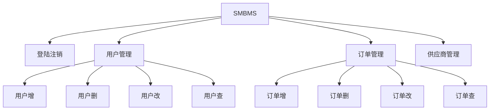
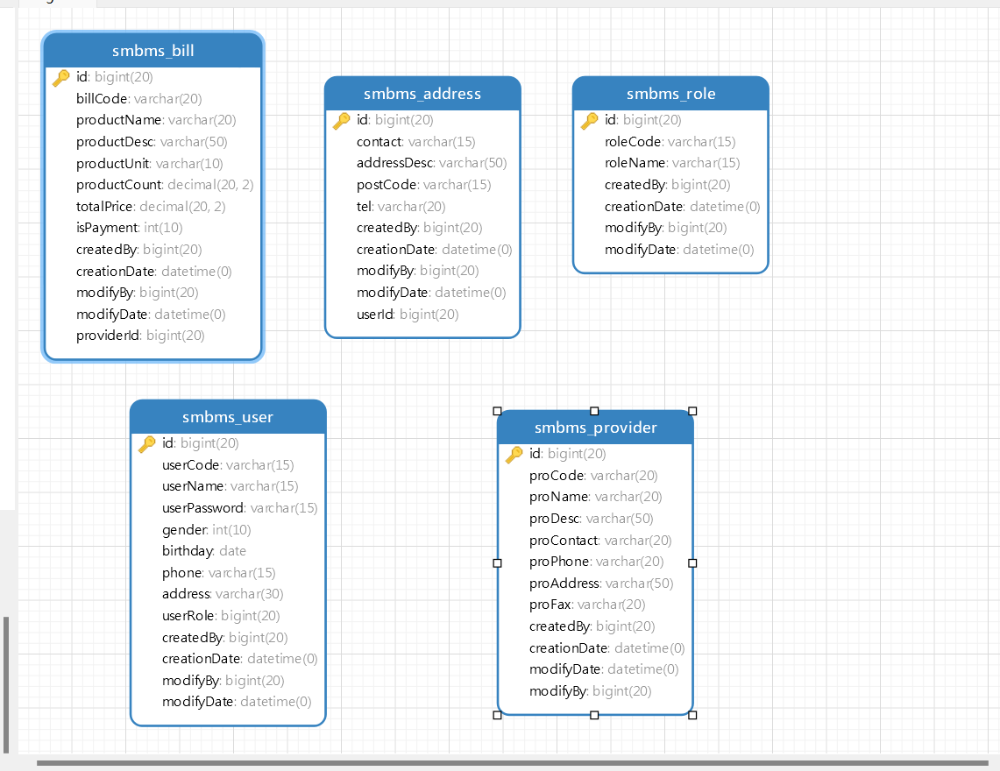
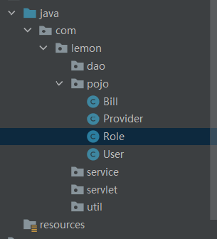

# SMBMS



数据库



## 项目搭建准备工作

1. 大家一个Maven web项目
2. 配置tomcat项目
3. 测试项目是否能够跑起来
4. 导入项目中需要的jar包
jsp,Servlet,mysql驱动，jstl,stand...
5. 创建项目包结构

6. 编写实体类
ORM映射：表-类映射
7. 编写基础公共类
    1. 数据库配置文件

        ```properties
        driver=com.mysql.Driver
        url=jdbc:mysql://localhost:3306?useUnicode=true&characterSet=utf-8
        user=root
        password=yan2000926
        ```

    2. 编写数据库的公共类
    3. 编写字符编码过滤器
8. 导入静态资源


## 登录功能的实现

```mermaid
graph TD;

    
```