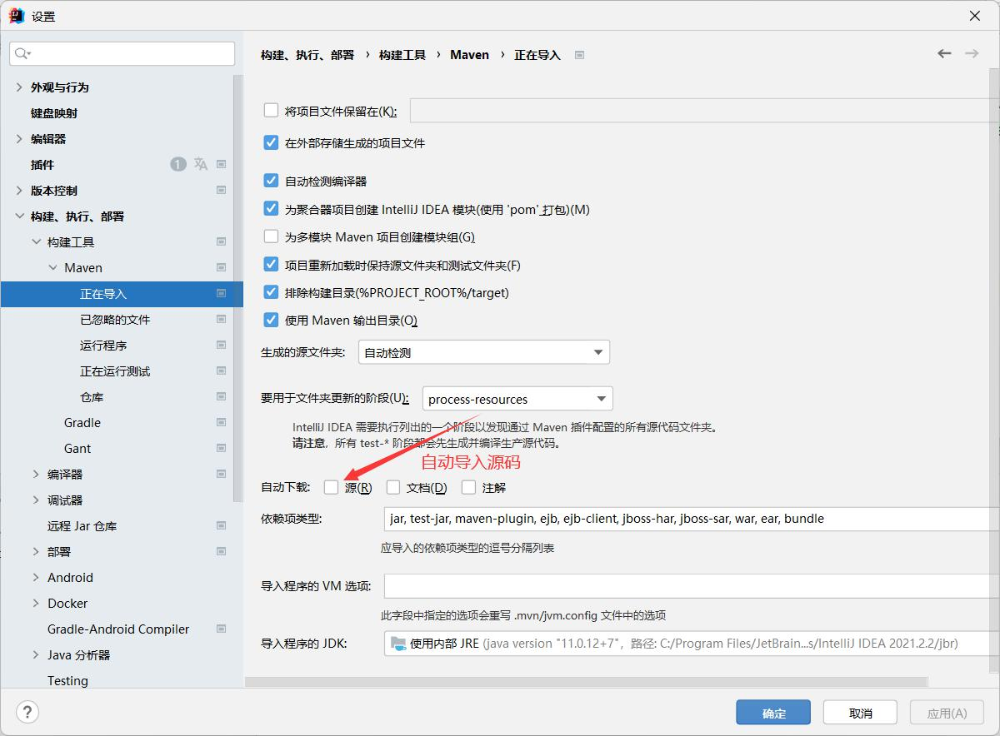

# JavaWeb

## 1. 基本概念

- Web 网页的意思，www.baidu.com
- 静态web
  - html,css
  - 提供给所以人看的数据始终不会发生变化
- 动态web
  - 几乎所有的网站；
  - 提供给所有人看的数据始终会发生变化，
 每个人在不同的时间，不同的地点看到的信息各不相同
  - 技术栈 Serlet/JSP,ASP,PHP

在Java中，动态web资源开发的技术统称为javaweb

## 1.2 web应用程序

web应用程序：可以提供浏览器访问的程序；

- a.html,b.html......多个web资源，这些web资源可以被外界访问，对外界提供服务
- 你们能访问的任何一个页面或者资源，都存在于这个世界的某一个角落的计算机上
- URL
- 这些统一的web资源会被放在同一个文件夹下，web应用程序--->tomcat：服务器
- 一个web应用由多部份组成（静态wen，动态web）
  - html,css,js
  - jsp,serlet
  - java程序
  - jar包
  - 配置文件(properties)

web应用程序编写完毕后，若想提供给外界访问，需要一个服务器来统一管理

## 1.3 静态web

- *.htm,*html 这些都是网页的后缀，如果服务器上一直存在这些东西，我们就
 可以直接读取。

- 静态web存在的缺点
  - web页面无法动态更新，所有用户看到的都是同一个页面
  - 轮播图，点击特效：伪动态
  - Javascript [实际开发中，它使用最多]
  - VBScript
- 它无法和数据库交互[数据无法持久化，用户无法交互]

## 1.4 动态web

页面会动态展示："Web的页面展示的效果因人而异"


缺点：

- 加入服务器的动态资源弧线了错误，我们需要更新动态的编写我们的后台程序
  - 停机维护

优点：

- web页面可以动态更新，所有用户看到的都不是同一个页面
- 它可以和数据库交互[数据持久化，注册、商品信息、用户信息]


## 2. Web服务器

**ASP**

- 微软：国内最早流行的就是ASP
- 在HTML中潜入了VB的脚本，ASP+COM
- 在ASP开发中，基本一个页面几千行的业务代码，页面积极混乱
- 维护成本高
- C#
- IIS

``` <h1> 
  <%
  
  Sysytem.out.println("hello")
  %>
 <\h1>
```

**PHP**

- PHP开发速度快，功能很强大，跨平台，代码简单（70%，WP）
- 无法承载大访问量的情况（局限性）

**JSP/Serlet**
BS:浏览器服务器架构模式
CS:客户端服务器架构模式

- Sun公司主推的B/S架构
- 基于Java语言的（所有的大公司或者开源的组件，都是用Java写的）
- 可以承载高并发、共性能、高可用带来的影响
- 语法像ASP，加强市场占有

## 2.2 Web服务器

服务器是一种被动的操作，用来处理用户的一些请求和给用户一些响应信息

**IIS**

微软的；ASP...，Window中自带的

**Tomcat**

Tomcat是Apache 软件基金会（Apache Software Foundation）的Jakarta 项目中的一个核心项目，
由Apache、Sun 和其他一些公司及个人共同开发而成。由于有了Sun 的参与和支持，最新的Servlet 和JSP 规范总是能在Tomcat 中得到体现，Tomcat 5支持最新的Servlet 2.4 和JSP 2.0 规范。因为Tomcat 技术先进、性能稳定，而且免费，因而深受Java 爱好者的喜爱并得到了部分软件开发商的认可，成为比较流行的Web 应用服务器。

**工作三到五年之后，可以尝试手写Tomcat服务器**

下载tomcat

1. 安装or解压
2. 了解配置文件及目录结构
3. 这个东西的作用

## 3.Tomcat

- 解压：路径不要有中文不要有空格
- 目录结构说明
  - bin 可执行文件
  - conf 配置文件目录
  - lib 存放lib的目录
  - logs 日志文件目录
  - webapps 项目部署的目录
  - work 工作目录
  - temp 临时目录
- 配置环境变量
  - 因为tomcat是Java和C编写的，因此需要JRE，所以需要配置JAVA_HOME
- bin文件夹内startup.exe 打开文件启动tomcat
**高难度面试题**
谈谈网站是如何进行访问的？

1. 输入网址，回车
2. 检查本机的C:\Windows\System32\drivers\etc\hosts 配置文件有没有这个域名映射
 1. 有：直接返回对应的ip地址
 2. 没有：去DNS服务器寻找，找到就返回ip,找不到就返回404

## 4.HTTP

**4.1 什么是HTTP**

超文本传输协议（Hyper Text Transfer Protocol，HTTP）是一个简单的请求-响应协议，
通常运行在TCP上

- 文本：html、字符串
- 超文本：图片、音乐、视频、定位、地图
- 端口 80

https:安全的

- 端口 443

**4.2 两个时代**

- http1.0
  - HTTP/1.0:客户端可以与web服务器连接后，只能获得一个web资源，断开连接
- http2.0
  - HTTP/1.1：客户端可以与web服务器连接后，可以获取多个web资源

**4.3 Http请求**

客户端---发请求（Request）---服务器

百度

```
Request URL: https://www.baidu.com/
Request Method: GET
Status Code: 200 OK
Remote Address: 127.0.0.1:33210
Referrer Policy: unsafe-url
```

1. 请求行
 - 请求行中的请求方式：GET
 - 请求方式：**GET、POST**、HEAD、DELETE、PUT、
  - get: 请求能够携带的参数比较少，大小会有限制，会在浏览器的URL地址栏显示数据内容，不安全但高效
  - post: 请求能够携带的参数没有限制，大小没有限制，不会在地址栏显示数据内容，安全但不高效
2. 消息头

```
Accept: 告诉浏览器支持的数据类型
Accept-Encoding: 支持哪种编码
Accept-Language: 告诉浏览器，它的语言环境
Cache-Control: 缓存控制
Connection: 告诉浏览器，请求完成是断开还是保持链接
```

**4.4 Http响应**

服务器---响应---客户端

```
Bdpagetype: 2
Bdqid: 0xd16eb1470015222c
Cache-Control: private  缓存控制
Connection: keep-alive 链接
Content-Encoding: gzip 编码类型
Content-Type: text/html;charset=utf-8
Date: Sun, 13 Feb 2022 06:56:24 GMT
Expires: Sun, 13 Feb 2022 06:56:23 GMT
Server: BWS/1.1   
Set-Cookie: BDSVRTM=307; path=/  
Set-Cookie: BD_HOME=1; path=/
Set-Cookie: H_PS_PSSID=35106_31253_35765_35488_34584_35490_35872_35801_35797_26350_35881_35878_35746; path=/; domain=.baidu.com
Strict-Transport-Security: max-age=172800
Traceid: 1644735384346522650615091194319867290156
Transfer-Encoding: chunked
X-Frame-Options: sameorigin
X-Ua-Compatible: IE=Edge,chrome=1
```

1. 响应体

```
Accept: 告诉浏览器支持的数据类型
Accept-Encoding: 支持哪种编码
Accept-Language: 告诉浏览器，它的语言环境
Cache-Control: 缓存控制
Connection: 告诉浏览器，请求完成是断开还是保持链接
HOST: 主机.../
Refresh：告诉主机多久刷新一次
Location：让网页重新定位
```

2. 响应状态码

- 200：请求响应成功
- 404：找不到资源
- 3xx：请求重定向
- 5xx:服务器代码错误 502 网关错误

## 5.Maven

为什么要学习Maven？

1. 在javaweb开发中，需要使用大量的jar包，我们手动导入
2. 如何能让一个东西自动帮我导入和配置这个jar包

由此，Maven诞生了

**5.1 Maven项目架构管理工具**

我们目前用来方便导入jar包

maven的核心思想：**约定大于配置**

- 有约束，不要去违反

Maven会规定好你该如何去编写我们的Java代码，必须那按照这个规范来

**5.2下载并安装Maven**


下载完成后，解压即可

- 目录结构说明
  - bin 执行文件
  - conf 配置文件
  - boot 启动需要的一些jar包

**5.3 配置环境变量**

在系统环境变量中

配置如下配置：

- M2_HOME maven目录下的bin目录
- MAVEN_HOME maven的目录
- 在系统的path里配置 %MAVEN_HOME%\bin

测试Maven是否安装成功


**5.4 阿里云镜像**

- 镜像：mirrors
  - 作用：加速我们的下载
- 国内建议阿里云的镜像

```
  <mirror>
3         <id>nexus-aliyun</id>
4         <mirrorOf>*,!jeecg,!jeecg-snapshots</mirrorOf>
5         <name>aliyun maven</name>
6         <url>http://maven.aliyun.com/nexus/content/groups/public</url>
7      </mirror>
```

**5.5 本地仓库**

在本地的仓库，远程仓库

建立一个本地仓库

```<localRepository>D:\SoftWare\MavenRepository</localRepository>```

**5.6 在IDEA里只用Maven**


**IDEA中的Maven设置**


手动改为本地Maven路径



至此，maven在IDEA的配置和使用就成功了

**5.7 普通的创建一个普通的maven项目**


**5.8 标记文件夹功能**

第一种：


第二种：


**5.9 IDEA中配置tomcat**


解决警告问题


**5.10 pom文件**

pom.xml 是Maven的核心配置文件


Maven 由于它的约定大于配置，我们之后可能遇到我们写的配置文件不能被导出
或者生效的问题，解决方案：

```在build中配置resources，防止资源导出问题```

```
<build>
        <resources>
            <resource>
                <directory>src/main/resources</directory>
                <includes>
                    <include>**/*.properties</include>
                    <include>**/*.xml</include>
                </includes>
                <filtering>true</filtering>
            </resource>
            <resource>
                <directory>src/main/java</directory>
                <includes>
                    <include>**/*.properties</include>
                    <include>**/*.xml</include>
                </includes>
                <filtering>true</filtering>
            </resource>
        </resources>
    </build>
```

**5.12 IDEA操作**


**5.13Maven的仓库使用**

地址：<https://mvnrepository.com/>


搜索不到

但是tomcat可以使用所有tomcat应该有这个包，去tomcat lib文件夹寻找，
找到类似的包名，servlet-api


去仓库搜索servlet-api，找用的最多的


先选最新的，失败可以再降级，其次选使用人数最多的


把这个放进```<dependencies>```里


## 6.Servlet

**6.1 Servlet**

- Servlet就是SUN公司开发动态web的一门技术
- SUN公司在他的API中提供了一个接口叫做：Servlet，如果你想开发一个
Servlet程序，只需要完成两个小步骤：
  - 编写一个类，实现Servlet接口
  - 把开发好的Java类部署到服务器中

**把实现了Servlet接口的Java程序叫做，Servlet**

**6.2 Hello Servlet**
Servlet接口SUN公司有两个默认的是实现类：HttpServlet、GenericServlet

1. 构建一个普通的Maven项目，删掉里面的src目录，
以后我们学习就在这个项目里面建立Module，这个空的工程叫Maven的主工程
2. 关于Maven父子工程的理解：
父项目中会有

```
<modules>
        <module>Servlet</module>
</modules>
```

子项目会有

```
    <parent>
        <artifactId>JavaWeb-02-Servlet</artifactId>
        <groupId>org.example</groupId>
        <version>1.0-SNAPSHOT</version>
    </parent>
```

父项目中的Java子项目可以直接用
3. Maven环境优化
 1. 修改web.xml为最新的
 2. 将Maven的结构搭建完整
4. 编写一个Servlet程序
 1. 编写一个普通类
 2. 实现Servlet接口，继承HttpServlet

```
public class HelloServlet extends HttpServlet {
 
 //由于get/post只是请求实现的方式，可以相互调用，业务逻辑一样
 @Override
 protected void doGet(HttpServletRequest req, HttpServletResponse resp) throws ServletException, IOException {
  //ServletOutputStream outputStream = resp.getOutputStream();
  PrintWriter writer = resp.getWriter();//响应流
  writer.println("Hello Servlet");
 }

 @Override
 protected void doPost(HttpServletRequest req, HttpServletResponse resp) throws ServletException, IOException {
  super.doPost(req, resp);
 }
}

```

5. 编写Servlet的映射
 - 为什么我们需要映射？我们写的是Java程序，但要通过浏览器访问，
 而浏览器需要链接web服务器，所有我们需要再web服务中注册我们需要的Servlet，
 还需要给他一个浏览器能够访问的路径

```
<!--  注册Servlet-->
  <servlet>
    <servlet-name>hello</servlet-name>
    <servlet-class>test.HelloServlet</servlet-class>
  </servlet>
<!--  Servlet的请求路径-->
  <servlet-mapping>
    <servlet-name>hello</servlet-name>
    <url-pattern>/hello</url-pattern>
  </servlet-mapping>
```

访问/hello路径就会执行test.HelloServlet

6. 配置Tomcat
7. 启动测试

**6.3 Servlet原理**

Servlet是由Web服务器调用，web服务器收到请求之后，会：

**缺少图片**

**6.4 Mapping问题**

1. 一个Servlet可以指定一个映射路径

```
  <servlet-mapping>
    <servlet-name>hello</servlet-name>
    <url-pattern>/hello</url-pattern>
  </servlet-mapping>
```

2. 一个Servlet可以指定多个映射路径

```
  <servlet-mapping>
    <servlet-name>hello</servlet-name>
    <url-pattern>/hello</url-pattern>
  </servlet-mapping>

  <servlet-mapping>
    <servlet-name>hello</servlet-name>
    <url-pattern>/hello1</url-pattern>
  </servlet-mapping>

  <servlet-mapping>
    <servlet-name>hello</servlet-name>
    <url-pattern>/hello2</url-pattern>
  </servlet-mapping>
```

3. 一个Servlet可以指定通用映射路径

```
  <servlet-mapping>
    <servlet-name>hello</servlet-name>
    <url-pattern>/hello/*</url-pattern>
  </servlet-mapping>
```


4. 默认请求路径

```
  <servlet-mapping>
    <servlet-name>hello</servlet-name>
    <url-pattern>/*</url-pattern>
  </servlet-mapping>
```

5. 指定一些后缀或者前缀等等......

```
 //后缀
  <servlet-mapping>
    <servlet-name>hello</servlet-name>
    <url-pattern>*.lemon</url-pattern>
  </servlet-mapping>
```


6. 优先级问题

- 指定了固有的映射优先级最高，如果找不到就会走默认的请求处理：

```
<!--  404-->
  <servlet>
    <servlet-name>error</servlet-name>
    <servlet-class>test.errorServlet</servlet-class>
  </servlet>

  <servlet-mapping>
    <servlet-name>error</servlet-name>
    <url-pattern>/*</url-pattern>
  </servlet-mapping>
```

**6.5 ServletContext**

web容器在启动的时候，它会为每个web程序创建一个对应的ServletContext对象，
它代表了当前的Web应用：

1. 共享数据
 
我在这个Servlet中保存的数据，可以在另外一个servlet中拿到

```
//放置数据
public class HelloServlet extends HttpServlet {
 @Override
 protected void doGet(HttpServletRequest req, HttpServletResponse resp) throws ServletException, IOException {
  ServletContext servletContext1 = this.getServletContext();
  String USername = "河南";
  servletContext1.setAttribute("Username",USername);//将一个数据保存在ServletContext中

 }
}

//获取数据

 protected void doGet(HttpServletRequest req, HttpServletResponse resp) throws ServletException, IOException {
  resp.setContentType("text/html");
  resp.setCharacterEncoding("utf-8");
  ServletContext servletContext2 = this.getServletContext();
  String username = (String) servletContext2.getAttribute("Username");
  resp.getWriter().println(username);
 }
 
 
```

2. 获取初始参数

3. 请求转发

```
 protected void doGet(HttpServletRequest req, HttpServletResponse resp) throws ServletException, IOException {
  resp.setContentType("text/html");
  resp.setCharacterEncoding("utf-8");
  ServletContext servletContext = this.getServletContext();
  RequestDispatcher requestDispatcher = servletContext.getRequestDispatcher("/demo1"); //转发的请求
  requestDispatcher.forward(req,resp);//调用forward实现请求转发
 }
 
```

4. 读取资源文件
Properties

- 在Java目录下新建properties
- 在resources目录下新建properties
发现：都被打包到了同一个路径下classes，我们俗称这个路径为classpath
思路：需要一个文件流

**6.6、HttpServletResponse**

Web服务器接收端哦客户端的合http请求，针对这个请求分别创建一个代表请求的，
HttpServletRequest对象，代表响应的一个HttpServletResponse；

- 如果要获取客户端请求的参数：找HttpServletRequest
- 如果要给客户端响应一些信息：找HttpServletResponse

1. 简单分类

- **负责向浏览器发送数据的方法**

```java
ServletOutputStream getOutputStream() throws IOException;
PrintWriter getWriter() throws IOException;
```

- **负责向浏览器发送响应头**

- **响应的状态码**

```java
int SC_CONTINUE = 100;
    int SC_SWITCHING_PROTOCOLS = 101;
    int SC_OK = 200;
    int SC_CREATED = 201;
    int SC_ACCEPTED = 202;
    int SC_NON_AUTHORITATIVE_INFORMATION = 203;
    int SC_NO_CONTENT = 204;
    int SC_RESET_CONTENT = 205;
    int SC_PARTIAL_CONTENT = 206;
    int SC_MULTIPLE_CHOICES = 300;
    int SC_MOVED_PERMANENTLY = 301;
    int SC_MOVED_TEMPORARILY = 302;
    int SC_FOUND = 302;
    int SC_SEE_OTHER = 303;
    int SC_NOT_MODIFIED = 304;
    int SC_USE_PROXY = 305;
    int SC_TEMPORARY_REDIRECT = 307;
    int SC_BAD_REQUEST = 400;
    int SC_UNAUTHORIZED = 401;
    int SC_PAYMENT_REQUIRED = 402;
    int SC_FORBIDDEN = 403;
    int SC_NOT_FOUND = 404;
    int SC_METHOD_NOT_ALLOWED = 405;
    int SC_NOT_ACCEPTABLE = 406;
    int SC_PROXY_AUTHENTICATION_REQUIRED = 407;
    int SC_REQUEST_TIMEOUT = 408;
    int SC_CONFLICT = 409;
    int SC_GONE = 410;
    int SC_LENGTH_REQUIRED = 411;
    int SC_PRECONDITION_FAILED = 412;
    int SC_REQUEST_ENTITY_TOO_LARGE = 413;
    int SC_REQUEST_URI_TOO_LONG = 414;
    int SC_UNSUPPORTED_MEDIA_TYPE = 415;
    int SC_REQUESTED_RANGE_NOT_SATISFIABLE = 416;
    int SC_EXPECTATION_FAILED = 417;
    int SC_INTERNAL_SERVER_ERROR = 500;
    int SC_NOT_IMPLEMENTED = 501;
    int SC_BAD_GATEWAY = 502;
    int SC_SERVICE_UNAVAILABLE = 503;
    int SC_GATEWAY_TIMEOUT = 504;
    int SC_HTTP_VERSION_NOT_SUPPORTED = 505;
```

2. 常见应用

- 向浏览器输出消息
- 下载文件
 1. 获取下载文件的路径
 2. 下载文件的名字
 3. 设置让浏览器支持下载我们需要的东西
 resp.setHeader("Content-disposition","attachment;filename"+fileName);
 中文文件名URLEncoder.encode(fileName,"UTF-8")
 4. 获取下载文件的输入流
 5. 创建缓冲区
 6. 获取OutPutStream对象
 7. 将 FileInputStream流写入buffer缓冲区
 8. 使用OutPutStream将缓冲区的数据输出到客户端

3. 验证码功能
 
 验证码怎么来的？
 1. 前端实现
 2. 后端实现，需要用到Java的图片类，生成一个图片
4. 重定向
 
 一个Web资源收到客户端请求后，他会通知客户端去访问另一个web资源，这个过程叫
 重定向
 
 常见场景：
 - 用户登录
 
 ```void sendRedirect(String var1) throws IOException;```
 
 测试：

```java
 protected void doGet(HttpServletRequest req, HttpServletResponse resp) throws ServletException, IOException {
  /*resp.setHeader("Location","/r3/img");
  resp.setStatus(302);*/
  resp.sendRedirect("/r3/img"); //重定向
 }
```

 面试题：请你聊聊重定向和转发的区别？
 
 相同点
  - 页面都会是实习实现跳转
 
 不同点
  - 请求转发时，url不会发生变化 statuscode:307
  - 重定向的时候，url地址栏会变化 statuscode:302

**6.7、HttpServletRequest**

HttpServletRequest代表客户端的请求，用户通过Http协议访问服务器，
HTTP请求中的所以信息会被封装到HttpServletRequest，通过这个
HttpServletRequest的方法，获得客户端的所有信息

1. 获取前端传递的参数


2. 请求转发

```java
public class LoginServlet  extends HttpServlet {
 @Override
 protected void doGet(HttpServletRequest req, HttpServletResponse resp) throws ServletException, IOException {
  String username = req.getParameter("username");
  String password = req.getParameter("password");
  String[] hobbys = req.getParameterValues("hobbys");
  System.out.println("-------------------");
  System.out.println(username);
  System.out.println(password);
  System.out.println(Arrays.toString(hobbys));

  //通过请求转发
  System.out.println(req.getContextPath());
  req.getRequestDispatcher("/success.jsp").forward(req,resp);
 }

 @Override
 protected void doPost(HttpServletRequest req, HttpServletResponse resp) throws ServletException, IOException {
  doGet(req, resp);
 }
}
```

## 7.Cookies、Session

**7.1、会话**

**会话**：用户打开一个浏览器、点击了很多超链接、访问了多个web资源，
关闭浏览器，这个过程可以称之为会话

**有状态会话**:

一个网站怎么证明你来过？

服务端   客户端

1. 服务端给客户端一个“信件”，客户端下次访问服务端带上信件就可以了：cookie
2. 服务器登记你来过了，下次你来的时候我来匹配你：seesion

**7.2 保存会话的两种技术**

**cookie**

- 客户端技术（响应、请求）

**session**

- 服务器技术，利用这个技术，可以保存用户的会话信息,把数据放到session中
 
**7.3 Cookie**
 
1. 从请求中拿到Cookie信息
2. 服务器响应给客户端Cookie

```java
Cookie[] cookies = req.getCookies();//获得Cookie
cookies.getName()；//获得cookie的Key
cookies.getValue();//获得Cookie的Value
Cookie cookie = new Cookie("LastLoginTime",System.currentTimeMillis()+"");
//新建一个Cookie
resp.addCookie(cookie)；//响应给客户端一个cookie
```

**Cookie：一般存在本地的用户目录下 AppData**

一个网站cookie是否存在上限？
 - 一个Cookie只能保存一个信息

- 一个Web站点可以给浏览器发送多个Cookie，最多存放20个Cookie
- 300个Cookie是浏览器的上限
- Cookie大小有4KB限制

**删除Cookie:**

- 不设置有效期，浏览器关闭自动失效
- 设置有效期时间为0

**解码编码**

```URLDecoder.decode(cookie.getValue(),"utf-8");```

**7.4 Session（重点）**

什么是Session：

- 服务器会给每一个用户创建一个Session对象
- 一个Session独占一个浏览器，只要浏览器没有关闭。这个Session就存在
- 用户登录之后，整个网站他都可以访问

Session和Cookie的区别：
- Cookie是把用户的数据写到用户的浏览器，浏览器保存
- Session是把用户的数据写到用户独占的Session中
- Session对象由服务器创建

使用场景：
- 保存一个登陆用户的信息
- 购物车信息
- 在整个网站中经常会使用的数据。我们将它保存在Session中

## 8.JSP

**8.1 什么是JSP**

Java Server Pages：Java服务器端页面，也和Servlet一样，用于动态Web技术

最大的特点：
- 写JSP就是再写HTML
- 区别：
  - HTML之给用户提供静态数据
  - JSP页面可以嵌入Java代码，为用户创建动态数据

**8.2 JSP原理**

思路：JSP到底怎么运行

- 代码层面没有任何问题
- 服务器内部工作
  - tomcat中有一个work目录
  - Idea中使用Tomcat会在IDEA中生产一个work目录

**浏览器向服务器发送请求，无论访问什么资源，其实都是在访问Servlet**

JSP最终也会被转换为Java类，JSP本质上就是Servlet
**JSP**

1. 判断请求
2. 内置一些对象

```
JSP内置对象(9个内置对象):
1.PageContext javax.servlet.jsp.PageContext JSP的页面容器  //页面上下文
2.request javax.servlet.http.HttpServletrequest 获取用户的请求信息
3.response javax.servlet.http.HttpServletResponse 服务器向客户端的回应信息
4.session javax.servlet.http.HttpSession 用来保存每一个用户的信息
5.application javax.servlet.ServletContext 表示所有用户的共享信息
6.config javax.servlet.ServletConfig 服务器配置信息，可以取得初始化参数
7.out javax.servlet.jsp.jspWriter 页面输出
8.page java.lang.object)
9.exception java.lang.Throwable
```

在JSP页面中：
只要是Java代码就会原封不动的输出
如果是HTML代码，就会被转换为```out.write("html代码")```

**8.3JSP基础语法**

任何语言都有自己的语法，Java中有。JSP作为Java技术的一种应用，它拥有一些自己扩展的语法

**JSP表达式**

```
<%--  JSP表达式
作用：用来将程序的输出，输出到客户端
--%>
<%= new java.util.Date()%>
```

**JSP脚本片段**

```
 <%
    int sum = 0;
    for(int i=0; i<100;i++){
      sum+=i;
    }
    out.println("<h1>Sum = "+sum+"</h1>");
  %>
```

**脚本片段的再实现**

```
<%--  在代码中嵌入HTMl元素--%>

  <%
    for(int i =0;i<5;i++){


  %>
    <h1>hello,world <%=i%></h1>
  <%
    }
  %>
  
```

**8.4 JSP声明**

```
<%!
   

%>

```

JSP声明：会被编译到JSP生成Java的类中！其他的，就会被生成到_jspService方法

**8.5 9大内置对象**

- PageContext javax.servlet.jsp.PageContext JSP的页面容器  //页面上下文
- request javax.servlet.http.HttpServletrequest 获取用户的请求信息
- response javax.servlet.http.HttpServletResponse 服务器向客户端的回应信息
- session javax.servlet.http.HttpSession 用来保存每一个用户的信息
- application javax.servlet.ServletContext 表示所有用户的共享信息
- config javax.servlet.ServletConfig 服务器配置信息，可以取得初始化参数
- out javax.servlet.jsp.jspWriter 页面输出
- page java.lang.object)  //几乎不用
- exception java.lang.Throwable

request：客户端发送请求，产生的数据，客户看完就没用了，比如：新闻，用户看完就没用了

session：客户端发送请求，产生的数据，用户用完了还有用，比如购物车

application：客户端发送请求，产生的数据，一个用户用完了，
其他用户还可能使用，比如聊天信息

**8.6 JSP标签、JSTL标签、EL表达式**

```
<!--        JSTL表达式的依赖-->
        <dependency>
            <groupId>javax.servlet.jsp.jstl</groupId>
            <artifactId>jstl-api</artifactId>
            <version>1.2</version>
        </dependency>
```

**EL表达式：**${}

- 获取数据
- 执行运算
- 获取web常用的开发对象

**JSP标签：**

```
<%--<jsp:include page=""--%>

<jsp:forward page="jsptag2.jsp">
    <jsp:param name="age" value="12"/>
</jsp:forward>
```

**JSTL标签：**

JSTL标签库的使用就是为了弥补HTML标签的不足；它自定义了很多标签，
可以供我们使用，标签的功能和Java代码一样

- 核心标签（需要掌握）
- 格式化标签
- SQL标签
- XML标签

**JSTL标签库使用步骤**

- 引入对应的 taglib
- 使用其中的方法
- 在Tomcat中也需要导入jstl包


1. 没有导入standard，导致uri爆红,在pom.xml导入即可

2. 也有可能是服务器没有jstl包，复制进去一个就行

## 9.JavaBean

实体类

JavaBean有特定的写法：

- 必须有一个无参构造
- 属性必须私有化
- 必须有对应的get/set方法

一般用来和数据库的字段做映射 ORM
ORM：对象关系映射

- 表--->类
- 字段--->属性
- 行记录--->对象

**people表**

|id |name |age |
|-- |-- |-- |
|1 |小明1 |3 |
|2 |小明2 |50 |
|3 |小明3 |75 |

``` Java
class People{
 private int id;
 private String name;
 private int age;
}

```

## 10、MVC三层架构

什么是MVC: Model View Controller 模型 视图 控制器

控制器：Control Servlet

1. 接受用户的请求(req:请求参数、Session信息)
2. 交给业务处理对应的代码
3. 控制视图的跳转

视图：View JSP

1. 展示数据
2. 提供链接发起Servlet请求（a,from,img...）

模型：Model

1. 业务处理：业务逻辑（service）
2. 数据持久层：CRUD（Dao）

控制业务操作、保存数据、修改数据、删除查询数据

**区别**

Servlet和JSP都可以写Java代码：为了易于维护和使用；

Servlet专注于处理请求，以及控制视图转跳、JSP专注于显示数据

**10.1 过去**

用户直接访问控制层，控制层就可以直接操作数据库；

```
Servlet -> CRUD ->数据库
弊端：程序十分臃肿，不利于维护  
Servlet的代码中：处理请求、响应、视图跳转、处理逻辑代码

架构：没有什么是加一层解决不了的

```

## 11、Filter（重点）

Filter:过滤器，用来过滤网站的数据

- 处理中文乱码
- 登陆验证...

web服务器  <---过滤器---> Servlet
双向过滤

Filter开发步骤

1. 导包
2. 编写过滤器
 - 导包不要错 import javax.servlet.Filter;


```java
package com.lemon.filter;

import javax.servlet.*;
import java.io.IOException;

public class CharacterEncodingFilter implements Filter {
 @Override
 public void init(FilterConfig filterConfig) throws ServletException {
  System.out.println("Filter 初始化");
 }

 @Override
 public void doFilter(ServletRequest servletRequest, ServletResponse servletResponse, FilterChain filterChain) throws IOException, ServletException {
  servletRequest.setCharacterEncoding("utf-8");
  servletResponse.setCharacterEncoding("utf-8");
  servletResponse.setContentType("text/html;charset=UTF-8");

  System.out.println("FilterChain执行前");
  filterChain.doFilter(servletRequest, servletResponse); //让我们的请求继续走，如果不写程序将在这里被拦截终止
  System.out.println("FilterChain执行后");
 }

 //销毁：web服务器关闭时，过滤器会销毁
 @Override
 public void destroy() {
  System.out.println("Filter 销毁");
 }
}
```

**web.xml配置**

```
    <servlet>
        <servlet-name>ShowServlet</servlet-name>
        <servlet-class>com.lemon.Servlet.ShowServlet</servlet-class>
    </servlet>
<!--    有过滤器访问-->
    <servlet-mapping>
        <servlet-name>ShowServlet</servlet-name>
        <url-pattern>/servlet/show</url-pattern>
    </servlet-mapping>
<!--没有过滤器访问-->
    <servlet-mapping>
        <servlet-name>ShowServlet</servlet-name>
        <url-pattern>/show</url-pattern>
    </servlet-mapping>

    <filter>
        <filter-name>Filter</filter-name>
        <filter-class>com.lemon.filter.CharacterEncodingFilter</filter-class>
    </filter>

    <filter-mapping>
        <filter-name>Filter</filter-name>
        <!-- 只要是/servlet的任何请求都会经过这个过滤器       -->
        <url-pattern>/servlet/*</url-pattern>
    </filter-mapping>
```

## 12、监听器

实现一个监听器的接口：

1. 编写一个监听器
实现监听器的接口

``` java
import javax.servlet.ServletContext;
import javax.servlet.http.HttpSessionEvent;
import javax.servlet.http.HttpSessionListener;

//统计网站在线人数；统计Session
public class OnlineCountListener implements HttpSessionListener {
 //创建Session监听
 //一旦创建一个Session，就会触发这个事件
 @Override
 public void sessionCreated(HttpSessionEvent httpSessionEvent) {
  System.out.println(httpSessionEvent.getSession().getId());
  ServletContext ctx = httpSessionEvent.getSession().getServletContext();
  Object onlineCount = (Integer)ctx.getAttribute("OnlineCount");

  if(onlineCount == null){
   onlineCount = new Integer(1);
  }else{
   int count = (int) onlineCount;

   onlineCount = new Integer(count+1);
  }

  ctx.setAttribute("OnlineCount",onlineCount);
 }

 //销毁Session监听
 //一旦销毁一个Session，就会触发这个事件
 @Override
 public void sessionDestroyed(HttpSessionEvent httpSessionEvent) {

 }

 /**
  * Seesion销毁：
  *  1.手动销毁 getSession().invalidate()
  *  2.自动销毁
  */
```

1. 在web.xml中注册监听器

``` xml
    <listener>
        <listener-class>com.lemon.listener.OnlineCountListener</listener-class>
    </listener>
 
```

2. 看情况是否使用

## 12、过滤器、监听器常见应用

监听器：GUI编程中经常使用

``` java
import java.awt.*;
import java.awt.event.WindowAdapter;
import java.awt.event.WindowEvent;
import java.awt.event.WindowListener;

public class TestPanel {
 public static void main(String[] args) {
  Frame frame = new Frame("315快乐");
  Panel panel = new Panel(null);
  frame.setLayout(null);//设置窗体布局

  frame.setBounds(300,300,500,500);

  frame.setBackground(new Color(0,0,255));

  panel.setBounds(50,50,300,300);
  panel.setBackground(new Color(0,255,0));

  frame.add(panel);

  frame.setVisible(true);

  //监听事件，监听关闭

  frame.addWindowListener(new WindowAdapter() {
   @Override
   public void windowClosing(WindowEvent e) {
    System.exit(0);
   }
  });
 }
}
```

用户登录之后才能进入主页！用户注销就不能进入主页！

1. 用户登录之后，向Session中放入用户的数据
2. 进入主页的时候要判断用户是否已经登录；要求：在过滤器中实现

## 14、JDBC

什么是JDBC：Java链接数据库

需要jar包的支持：

- java.sql
- javax.sql
- mysql-connector-j 链接驱动必须导入
、

**事务**

要么都成功，要么都失败！

ACID原则：保证数据的安全

```java
1. 开启事务
2. 事务提交
3. 事务回滚	rallback()
4. 关闭事务
```

**Junit单元测试**

依赖

``` xml
        <dependency>
            <groupId>junit</groupId>
            <artifactId>junit</artifactId>
            <version>4.13.1</version>
            <scope>compile</scope>
        </dependency>
```